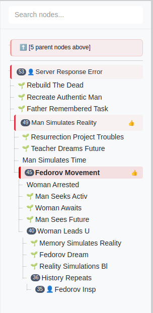

<p align="left" style="font-size:48px;">
  
  MiniLoom
</p>

MiniLoom is a native desktop application for writing with and exploring large language
models. It lets you keep LLM completions on track by sampling multiple times and
picking the best continuation. Unlike typical chat interfaces that let you reroll
a single step but hide the other branches, MiniLoom lets you see the tree and rapidly
navigate it. It is useful for writing prose with base models and debugging prompts
on instruction models. MiniLoom is open source and cross platform, you can use it with
most OpenAI compatible APIs such as OpenRouter and vllm on Windows, Mac, and Linux.
It is inspired by [Janus's loom](https://generative.ink/posts/loom-interface-to-the-multiverse/)
but a more useful point of comparison for most users might be something like [SillyTavern](https://github.com/SillyTavern/SillyTavern).

## Features

- Desktop application with native UI
- Text generation capabilities from a variety of LLM APIs (supports OpenAI Completions and Chat formats, you specify the URL; verified to work with Together, OpenRouter, VLLM, OpenAI, X AI, Google AI, Anthropic)
- Edit anywhere in the window without breaking things or changing history through MiniLoom's immutable tree of diffs data structure
- Quickly switch between different models, API keys, and providers for experiments with modular settings and customizable preset buttons
- Full text search over the tree

## Getting Started

### Downloads

[](https://github.com/JD-P/miniloom/releases/download/v1.0.0/windows-2022-build.zip)
[](https://github.com/JD-P/miniloom/releases/download/v1.0.0/macos-latest-build.1.zip)
[<img src="assets/Tux-simple.png" width="50" height="50"](https://github.com/JD-P/miniloom/releases/download/v1.0.0/ubuntu-latest-build.1.zip)

[(Tux, the Linux penguin, design by Larry Ewing, using The GIMP.)](https://commons.wikimedia.org/wiki/File:Tux-simple.svg)

### First Time Setup

When you first open MiniLoom, the app will automatically detect that you're a new user and open the Settings panel with a welcome message. Here's what you need to do to get started:

1. **Create a Service** (Required)
   - Click on the "🌐 Services" tab
   - Click "Add New" to create your first service
   - Choose a service type (OpenRouter is recommended for beginners)
   - Fill in the required details:
     - **Service Name**: Give it a memorable name (e.g., "My OpenRouter")
     - **API URL**: Usually pre-filled for popular services
     - **Model Name**: Choose a model (e.g., "deepseek/deepseek-v3-base:free" for OpenRouter)
   - Click "Save"

2. **Add an API Key** (Required for most services)
   - Click on the "🔑 API Keys" tab
   - Enter a name for your key (e.g., "OPENROUTER_KEY")
   - Paste your API key in the "Secret" field
   - Click "Add"
   - **Note**: Some APIs may work without a key for free tiers

3. **Configure Sampling** (Optional - Default provided)
   - Click on the "🎲 Samplers" tab
   - A "Default" sampler is automatically created for new users
   - You can customize it or create new ones as needed

### Using the App

1. **Select Your Configuration**
   - In the bottom control bar, select your Service, API Key, and Sampler
   - The order is: Service → Key → Sampler

2. **Start Generating**
   - Type your prompt in the main editor
   - Click the "🖋️ Generate" button
   - Your text will be generated and added to the tree structure

3. **Navigate and Expand**
   - Use the tree view on the left to navigate between different generations
   - Click on any node to focus on it and continue from that point
   - Use thumbs up/down to rate responses

### Tree Navigation Aids



MiniLoom's tree view has many cues to help you navigate the tree. These include:

- **Autogenerated node titles** for individual diffs. These are three word
  summaries made with the LLM you're looming with to help distinguish nodes.

- **Parent node outline** to let you backtrack to earlier nodes in the current
  branch.

- **Child node counter** so you know which child node(s) are the branches you chose
  to continue with. Most child nodes either have no children or are explored for a short
  way, so being able to see which ones have many children lets you quickly descend
  the tree towards interesting paths.

- 👤 **Author indicator** to distinguish human written nodes from AI generated nodes
  at a glance.

- 🌱 **New node indicator** lets you see which continuations you haven't opened yet.

- 👍 **Thumbs up and down emoji** so you can see which nodes you've marked as
  good and bad. These can be used as training data for RL and serve a similar purpose
  to the torches in minecraft by letting you know which branches you found promising,
  so rate nodes early and often.

## Getting Help

- 💬 **Questions & Discussion**: Join our [Discord](https://discord.gg/Y3HGwrcPwr)
- 🐛 **Bug Reports**: Use GitHub issues (confirmed bugs only)
- 💡 **Feature Ideas**: Discuss in Discord first, then create a GitHub issue

## Prerequisites

- Node.js / npm (version 14 or higher)

## Installation

1. Clone the repository:

```bash
git clone https://github.com/JD-P/miniloom.git
cd miniloom
```

2. Install dependencies:

```bash
npm install
```

## Usage

To start the application:

```bash
npm start
```

This will launch the MiniLoom desktop application.

## Development

The application is built with:

- Electron for the desktop framework
- Vanilla JavaScript for the frontend
- MiniSearch for search functionality
- Diff-match-patch for text comparison

## License

Apache License 2.0

This project is licensed under the Apache License 2.0 - see the [LICENSE](LICENSE) file for details.
